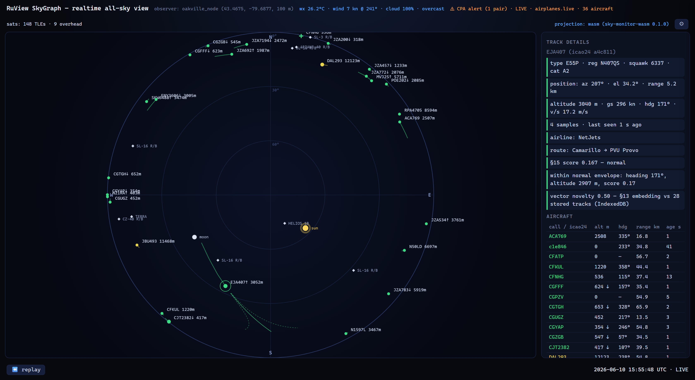

# SkyGraph

**A realtime all-sky radar in your browser.** Live aircraft, satellites, sun & moon — projected onto a polar sky dome around a fixed observer, scored for anomalies by a Rust/WASM engine, with no build step, no API keys, and no backend.



**▶ Live demo: [ruvnet.github.io/skygraph](https://ruvnet.github.io/skygraph/)**

The dome reads like a star chart of *everything moving above you*: the centre is straight up (zenith), the outer ring is the horizon, north is up. Every dot is a real aircraft from public ADS-B feeds, gliding at 60 fps; every diamond is a satellite propagated live with SGP4; the gold ✦ ones are sunlit against a dark sky — step outside and you can see them with the naked eye.

## What it does

- **Live air traffic** — polls [airplanes.live](https://airplanes.live) (fallback [adsb.lol](https://adsb.lol)) every 5 s for aircraft within 40 NM, with smoothed dead reckoning between polls so dots glide instead of snapping. Type, registration, squawk, wake category, climb/descend arrows; emergency squawks (7500/7600/7700) get a red double ring and a header alert.
- **Satellites** — CelesTrak TLEs (`visual` ≈ the 150 brightest, `stations`, or `starlink`) propagated *per frame* with SGP4 compiled to WebAssembly. A 24 h **pass predictor** lists upcoming naked-eye passes (rise–set, max elevation, direction) and can fire a browser notification 5 minutes before one.
- **Sun & moon** — drawn on the dome; the sun's position also drives the satellite illumination test (cylinder shadow model) that decides which passes are actually visible.
- **Anomaly scoring** — every live track is embedded into a 32-dim vector (in Rust/WASM) and scored against a rolling memory of past traffic persisted in IndexedDB: the dashboard literally *remembers your sky* across sessions. Scores follow the §15 composite formula with mandatory human-readable reasons; dots and rows take the band color (green normal → red strong anomaly).
- **Behavior badges** — geometric detectors flag holding patterns `[HOLD]`, survey grids `[GRID]`, go-arounds `[GO-AROUND]`, and formation pairs `[FORM]`.
- **Conflict prediction** — pairwise closest-point-of-approach in observer coordinates; predicted separation < 1 km horizontal and < 300 m vertical within 90 s draws a dashed alert line between the pair (visible in the screenshot header: "⚠ CPA alert").
- **Weather & space weather** — Open-Meteo current conditions (temperature, wind + gusts, humidity, pressure, cloud, precipitation) and the NOAA SWPC planetary Kp index with an aurora hint when it spikes.
- **Routes** — click an aircraft and its callsign resolves to airline + origin → destination via adsbdb.
- **Recorded replay** — the last hour of real traffic streams into an IndexedDB ring buffer; the footer ⏪ scrubber replays it. There is no synthetic data anywhere.
- **Offline grace** — block every API and the dome stays up with a retrying status line. Zero page errors, verified headless.

Everything is vanilla JavaScript ES modules + a single Canvas (an experimental WebGPU instanced path for Starlink-scale satellite counts hides behind a ⚙ toggle). Every file stays under 500 lines.

## Run it locally

The demo is fully static — any file server works (ES modules need `http://`, not `file://`):

```bash
git clone https://github.com/ruvnet/skygraph
cd skygraph/docs
python3 -m http.server 8000
# open http://localhost:8000/
```

The prebuilt WASM engine is committed at `docs/pkg/`, so this works with no toolchain at all.

## The ⚙ drawer

Top-right gear: toggle layers (aircraft / satellites / sun & moon / trails / labels / conflict alerts), pick the satellite TLE group, set trail length, try the WebGPU satellite renderer, and arm pass notifications. Settings persist in `localStorage`.

## Architecture

```
docs/                  the dashboard (GitHub Pages serves this)
  sky.js               conductor: render loop, selection, layer wiring
  project.js, astro.js projection math (WGS-84→az/el/range), sun/moon, sat illumination
  live-feed.js         ADS-B + weather polling, rolling tracks, table sync
  sat-feed.js          CelesTrak TLE fetch + 6 h cache
  novelty.js           IndexedDB embedding store → calibrated vector novelty
  score-live.js        §15 scoring bridge into the WASM AnomalyScorer
  behavior.js          holding / grid / go-around / formation detectors (pure fns)
  conflict.js          pairwise CPA + predicted-path cones (pure fns)
  passes.js            24 h visible-pass timeline + notifications
  record.js            recorded-replay ring buffer
  gpu-sats.js          experimental WebGPU instanced satellite sprites
  draw.js, panels.js, settings.js, route-info.js, space-wx.js
  pkg/                 prebuilt sky-monitor-wasm (committed for the demo)

core/                  Rust: the SkyGraph appliance core (ADR-199)
  coords, track, embedding, anomaly, …   pure subset → compiles to wasm32
  indexer, skygraph, pipeline            native-only (RuVector VectorDB + GraphDB)

wasm/                  Rust → WASM bindings used by the dashboard
  SkyProjector         batched WGS-84 → az/el/range projection
  SatPropagator        SGP4 from TLEs + predict_passes (24 h timeline)
  embed_track/novelty  32-dim track embeddings + indexer-calibrated novelty
  AnomalyScorer        the exact §15 composite scorer, native-parity tested
```

The projection, embedding, and scoring code paths in the browser are **the same Rust** as the native appliance — compiled to WebAssembly, with parity tests asserting identical output. A plain-JS mirror of the projection keeps the page functional if `docs/pkg/` is missing (satellites, novelty, and pass prediction need the WASM engine).

### Rebuild the WASM engine

```bash
# rustup target add wasm32-unknown-unknown && cargo install wasm-pack
wasm-pack build wasm --target web --out-dir ../docs/pkg
```

### The native appliance core

The full pipeline — RuVector `VectorDB` similarity search, the SkyGraph property graph with citeable `explain()`, daily sky briefs — runs natively:

```bash
cargo run -p sky-monitor --release     # synthetic-day demo + SkyGraph + brief
cargo test -p sky-monitor              # acceptance tests (ADR-199 §31)
cargo test -p sky-monitor-wasm         # wasm crate (native-parity, SGP4, screen mapping)
node --test docs/test/                 # behavior + CPA detectors
```

## Data sources (all free, no keys, CORS-friendly)

| Source | Data | Cadence |
|---|---|---|
| [airplanes.live](https://airplanes.live) / [adsb.lol](https://adsb.lol) | ADS-B aircraft within 40 NM | 5 s |
| [Open-Meteo](https://open-meteo.com) | current weather | 10 min |
| [CelesTrak](https://celestrak.org) | satellite TLEs | 6 h (cached) |
| [NOAA SWPC](https://www.swpc.noaa.gov) | planetary Kp index | 15 min |
| [adsbdb](https://www.adsbdb.com) | callsign → airline + route | on selection (24 h cache) |

The default observer is the reference *Oakville node* (43.4675 N, −79.6877 W). Edit `OBSERVER` in `docs/sky.js` to move it to your location.

## Origin

SkyGraph is the presentation plane of **ADR-199 ("Sky Monitor / SkyGraph appliance")** from the [RuVector](https://github.com/ruvnet/ruvector) project — *see the sky, remember the sky, explain the sky* — where the same core drives a native appliance with vector memory and a graph store. Built with [Claude Code](https://claude.com/claude-code) multi-agent swarms.

## License

[MIT](LICENSE) © 2026 rUv
